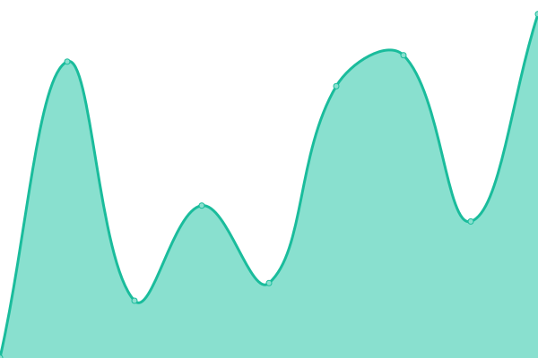

# [📈 Live Status](https://lerndmina.github.io/uptime): <!--live status--> **🟧 Partial outage**

This repository contains the open-source uptime monitor and status page for [Adam](https://imadam.io), powered by [Upptime](https://github.com/upptime/upptime).

With [Upptime](https://upptime.js.org), you can get your own unlimited and free uptime monitor and status page, powered entirely by a GitHub repository. We use [Issues](https://github.com/lerndmina/uptime/issues) as incident reports, [Actions](https://github.com/lerndmina/uptime/actions) as uptime monitors, and [Pages](https://lerndmina.github.io/uptime) for the status page.

<!--start: status pages-->
<!-- This summary is generated by Upptime (https://github.com/upptime/upptime) -->
<!-- Do not edit this manually, your changes will be overwritten -->
<!-- prettier-ignore -->
| URL | Status | History | Response Time | Uptime |
| --- | ------ | ------- | ------------- | ------ |
|  [imadam.io](https://imadam.io) | 🟩 Up | [imadam-io.yml](https://github.com/lerndmina/uptime/commits/HEAD/history/imadam-io.yml) | 

 1001ms
     
 | 

<a href="https://status.imadam.io/history/imadam-io">100.00%</a>
    

|  [commands.wiki](https://commands.wiki) | 🟩 Up | [commands-wiki.yml](https://github.com/lerndmina/uptime/commits/HEAD/history/commands-wiki.yml) | 

 726ms
     
 | 

<a href="https://status.imadam.io/history/commands-wiki">100.00%</a>
    

|  [shrt.zip](https://shrt.zip/dashboard) | 🟥 Down | [shrt-zip.yml](https://github.com/lerndmina/uptime/commits/HEAD/history/shrt-zip.yml) | 

 818ms
     
 | 

<a href="https://status.imadam.io/history/shrt-zip">99.21%</a>
    

|  [Thalwyrn](https://thalwyrn.com/index.php?route=/api/v2/info) | 🟩 Up | [thalwyrn.yml](https://github.com/lerndmina/uptime/commits/HEAD/history/thalwyrn.yml) | 

 768ms
     
 | 

<a href="https://status.imadam.io/history/thalwyrn">100.00%</a>
    

|  [MinIO](https://console.minioapp.uk) | 🟩 Up | [min-io.yml](https://github.com/lerndmina/uptime/commits/HEAD/history/min-io.yml) | 

 559ms
     
 | 

<a href="https://status.imadam.io/history/min-io">100.00%</a>
    

|  Handy (My Personal Server) | 🟩 Up | [handy-my-personal-server.yml](https://github.com/lerndmina/uptime/commits/HEAD/history/handy-my-personal-server.yml) | 

 544ms
     
 | 

<a href="https://status.imadam.io/history/handy-my-personal-server">100.00%</a>
    

|  Seedbox (for my linux ISOs) | 🟩 Up | [seedbox-for-my-linux-is-os.yml](https://github.com/lerndmina/uptime/commits/HEAD/history/seedbox-for-my-linux-is-os.yml) | 

 1362ms
     
 | 

<a href="https://status.imadam.io/history/seedbox-for-my-linux-is-os">99.84%</a>
    

<!--end: status pages-->

[**Visit our status website →**](https://lerndmina.github.io/uptime)

## 📄 License

- Powered by: [Upptime](https://github.com/upptime/upptime)
- Code: [MIT](./LICENSE) © [Anand Chowdhary](https://anandchowdhary.com), supported by [Pabio](https://pabio.com)
- Data in the `./history` directory: [Open Database License](https://opendatacommons.org/licenses/odbl/1-0/)
